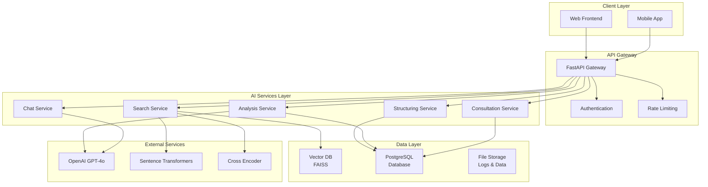
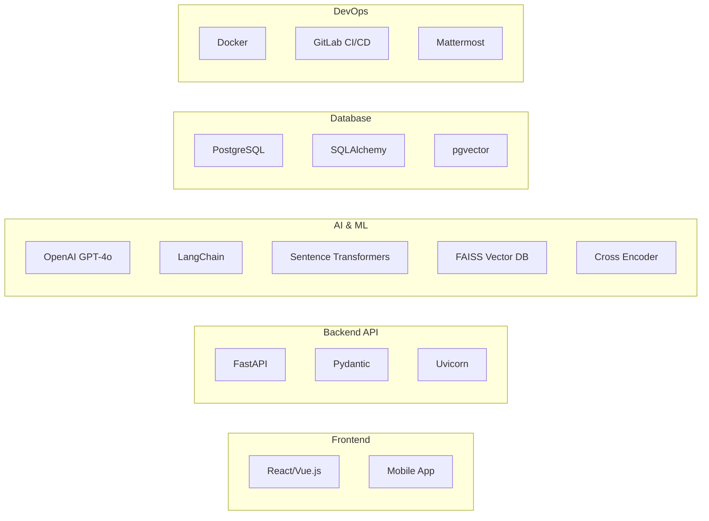
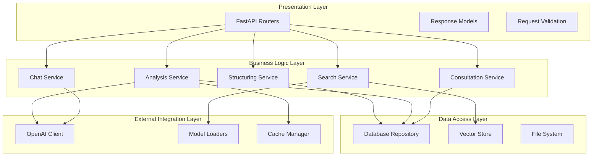
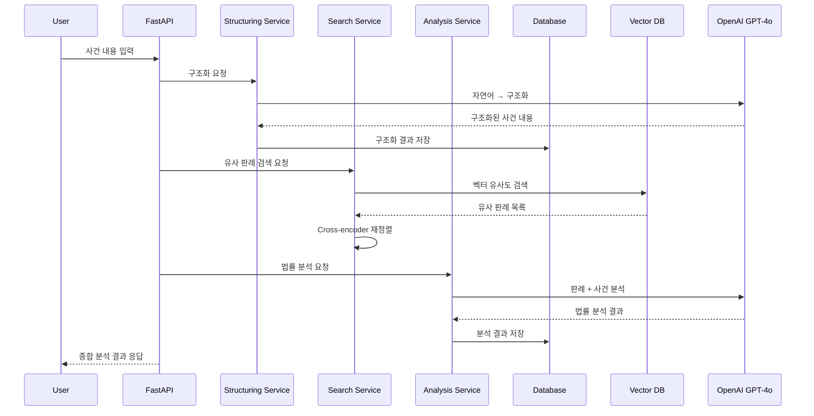
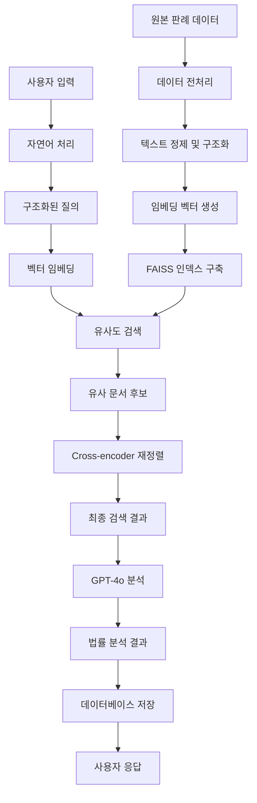
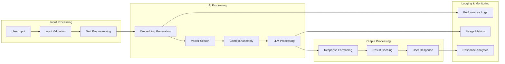
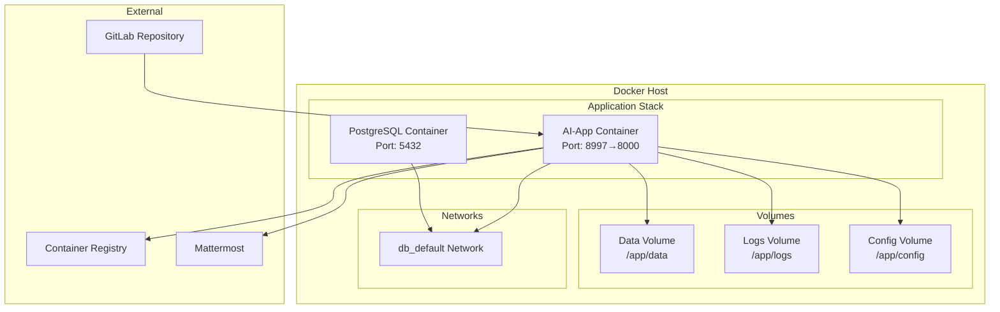
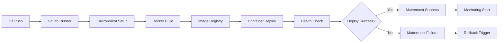
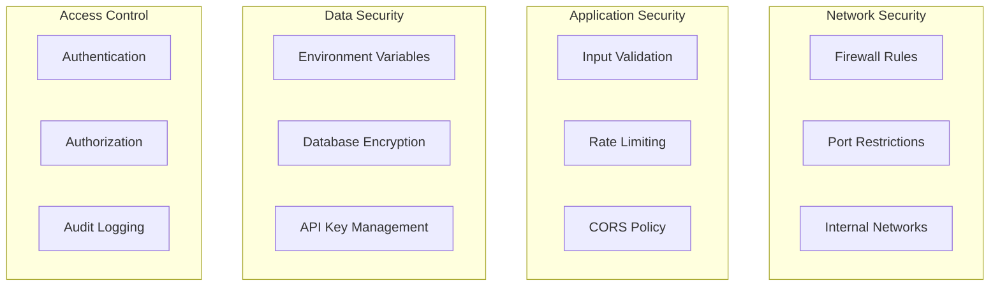

# 🏗️ 시스템 아키텍처 및 구조

## 📋 목차
- [전체 시스템 아키텍처](#전체-시스템-아키텍처)
- [프로젝트 파일 구조](#프로젝트-파일-구조)
- [서비스 아키텍처](#서비스-아키텍처)
- [데이터 플로우](#데이터-플로우)
- [배포 아키텍처](#배포-아키텍처)
- [보안 아키텍처](#보안-아키텍처)

---

## 🌐 전체 시스템 아키텍처

### **High-Level Architecture**


### **Technology Stack**


---

## 📁 프로젝트 파일 구조

### **디렉토리 구조 상세**
```
ALaw-AI-Backend/
│
├── 📁 app/                          # FastAPI 애플리케이션 코어
│   ├── 📁 api/                      # API 라우터 및 엔드포인트
│   │   ├── 📄 __init__.py
│   │   ├── 📄 dependencies.py       # 공통 의존성 정의
│   │   ├── 📄 exceptions.py         # 커스텀 예외 클래스
│   │   ├── 📄 handlers.py           # 예외 핸들러
│   │   ├── 📄 response_models.py    # API 응답 모델
│   │   └── 📄 decorators.py         # API 데코레이터
│   └── 📄 main.py                   # FastAPI 애플리케이션 초기화
│
├── 📁 services/                     # 비즈니스 로직 서비스 계층
│   ├── 📄 __init__.py
│   ├── 📄 case_analysis_service.py  # 법률 사건 분석
│   ├── 📄 chat_service.py           # 실시간 AI 챗봇
│   ├── 📄 consultation_service.py   # 상담 신청서 생성
│   ├── 📄 search_service.py         # 판례/법령 검색
│   └── 📄 structuring_service.py    # 사건 내용 구조화
│
├── 📁 config/                       # 설정 및 환경변수
│   ├── 📄 __init__.py
│   ├── 📄 .env                      # 환경변수 (보안, Git 제외)
│   ├── 📄 .env.example             # 환경변수 템플릿
│   ├── 📄 settings.py              # 애플리케이션 설정
│   └── 📄 tags.py                  # API 태그 정의
│
├── 📁 core/                        # 애플리케이션 핵심 컴포넌트
│   ├── 📄 __init__.py
│   └── 📄 container.py             # 의존성 주입 컨테이너
│
├── 📁 llm/                         # LLM 및 AI 모델 관련
│   ├── 📄 __init__.py
│   ├── 📄 llm_response_parser.py   # LLM 응답 파싱
│   └── 📄 structuring_parser.py    # 구조화 결과 파싱
│
├── 📁 utils/                       # 유틸리티 및 공통 모듈
│   ├── 📄 exceptions.py            # 공통 예외 정의
│   └── 📄 logger.py                # 로깅 설정
│
├── 📁 scripts/                     # 배치 스크립트 및 도구
│   ├── 📄 __init__.py
│   ├── 📄 build_index.py           # 벡터 인덱스 생성
│   ├── 📄 case_preprocessor.py     # 사건 데이터 전처리
│   └── 📄 collect_case_jsons.py    # 판례 데이터 수집
│
├── 📁 tests/                       # 테스트 코드
│   ├── 📄 __init__.py
│   └── 📄 conftest.py              # Pytest 설정
│
├── 📁 docker/                      # Docker 배포 환경
│   ├── 📄 Dockerfile               # AI 앱 컨테이너 정의
│   ├── 📄 docker-compose.yml       # 서비스 오케스트레이션
│   ├── 📄 README.md                # Docker 배포 가이드
│   └── 📄 update.sh                # 배포 업데이트 스크립트
│
├── 📁 db/                          # 데이터베이스 환경
│   ├── 📄 __init__.py
│   ├── 📄 database.py              # 데이터베이스 연결
│   ├── 📄 docker-compose.yml       # PostgreSQL 컨테이너
│   ├── 📄 dockerfile_postgres      # PostgreSQL Dockerfile
│   └── 📄 init_db.sql              # 데이터베이스 초기화
│
├── 📁 data/                        # AI 모델 및 데이터 저장소
│   ├── 📄 data.zip                 # 원본 데이터
│   ├── 📄 preprocessed.zip         # 전처리된 데이터
│   └── 📁 preprocessed/            # 전처리된 JSON 파일들
│
├── 📁 logs/                        # 애플리케이션 로그
│   └── 📄 [YYYY-MM-DD].log         # 일별 로그 파일
│
├── 📁 docs/                        # 프로젝트 문서
│   ├── 📄 ARCHITECTURE.md          # 시스템 아키텍처 문서
│   ├── 📄 CICD_GUIDE.md           # CI/CD 가이드
│   ├── 📄 OPERATIONS_GUIDE.md      # 운영 가이드
│   ├── 📄 CLAUDE.md                # AI 개발 히스토리
│   ├── 📄 ENV_SETUP_GUIDE.md       # 환경설정 가이드
│   └── 📄 REFACTORING_SUMMARY.md   # 리팩토링 기록
│
├── 📄 .gitlab-ci.yml               # GitLab CI/CD 파이프라인
├── 📄 .gitignore                   # Git 제외 파일 목록
├── 📄 requirements.txt             # Python 패키지 의존성
├── 📄 environment.yml              # Conda 환경 설정
├── 📄 pytest.ini                  # Pytest 설정
└── 📄 README.md                    # 프로젝트 개요 및 가이드
```

---

## 🔧 서비스 아키텍처

### **서비스 계층 구조**


### **AI 서비스 플로우**


---

## 🔄 데이터 플로우

### **데이터 처리 파이프라인**


### **실시간 데이터 플로우**


---

## 🚀 배포 아키텍처

### **Docker 컨테이너 구성**


### **CI/CD 파이프라인 아키텍처**


---

## 🔐 보안 아키텍처

### **보안 계층**


### **보안 정책**
- **환경변수**: 모든 API 키 및 민감 정보는 `.env` 파일로 관리
- **컨테이너 격리**: Docker 네트워크를 통한 서비스 간 통신 제한
- **로그 관리**: 민감 정보 로깅 금지, 로그 파일 권한 관리
- **API 보안**: CORS 설정, 요청 검증, 에러 메시지 최소화

---

## 📊 성능 및 확장성

### **성능 지표**
- **응답 시간**: 평균 2-5초 (AI 모델 추론 시간 포함)
- **동시 사용자**: 최대 50명 동시 처리 가능
- **메모리 사용**: 기본 4GB, 최대 8GB (모델 로딩 시)
- **디스크 I/O**: 로그 및 벡터 인덱스 접근

### **확장 방안**
- **수평 확장**: 로드 밸런서 + 다중 컨테이너 구성
- **수직 확장**: 서버 리소스 증설 (메모리, CPU)
- **캐싱**: Redis 도입으로 응답 속도 개선
- **비동기 처리**: Celery + RabbitMQ 도입으로 백그라운드 작업 처리

---

## 🔄 확장 로드맵

### **Phase 1: 현재 (단일 서버)**
- Docker 기반 단일 노드 배포
- GitLab CI/CD 자동화
- 기본 모니터링 및 알림

### **Phase 2: 고가용성 (3개월)**
- 로드 밸런서 도입
- 데이터베이스 복제 설정
- Redis 캐싱 계층 추가

### **Phase 3: 마이크로서비스 (6개월)**
- 서비스별 컨테이너 분리
- API Gateway 도입
- 분산 로깅 및 모니터링

### **Phase 4: 클라우드 네이티브 (12개월)**
- Kubernetes 오케스트레이션
- 자동 스케일링
- 멀티 리전 배포